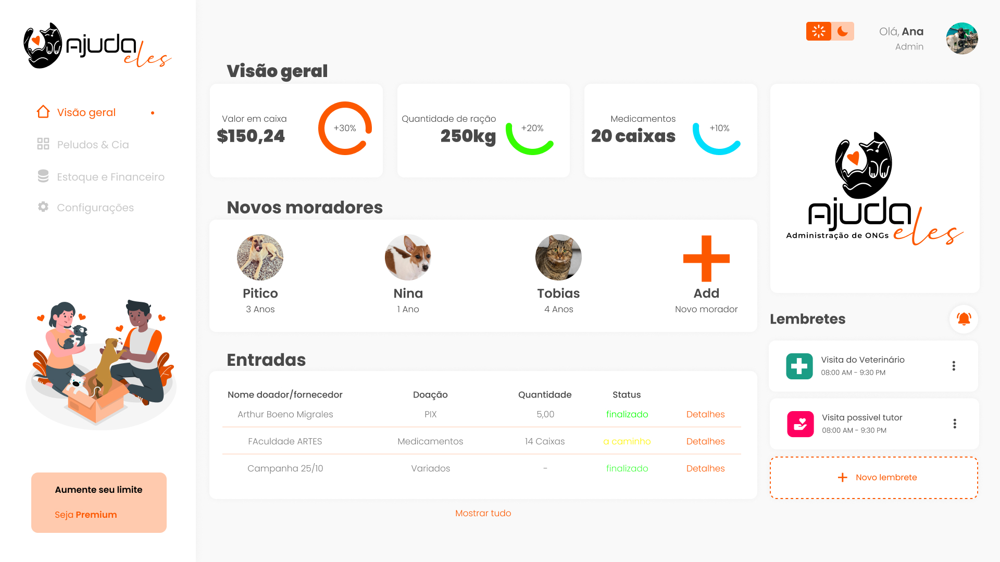
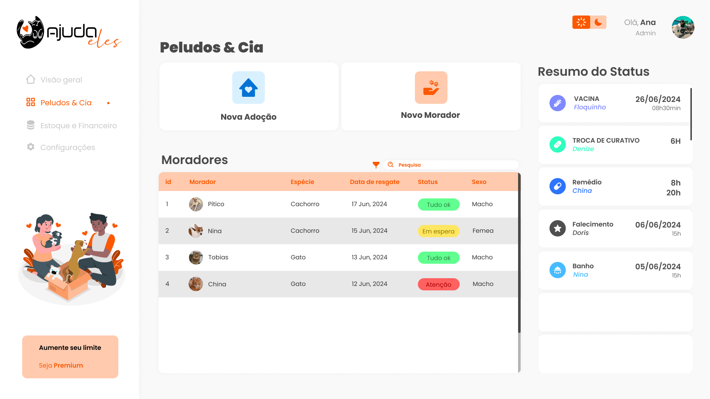
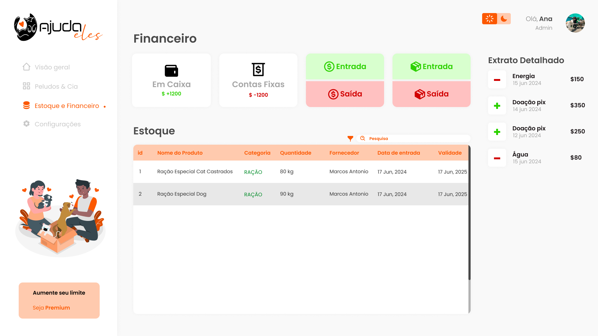

# 🐾 Ajuda Eles: Sistema de Gerenciamento para ONGs de Resgate e Adoção de Animais

## Descrição do Projeto

Desenvolvido para o curso de Análise e Desenvolvimento de Sistemas na UNINTER como tema de uma Atividade Extensionista: Tecnologia Aplicada à Inclusão Digital.

O **Ajuda Eles** é um sistema de gerenciamento projetado especificamente para ONGs que atuam no resgate, cuidado e encaminhamento de animais. Este projeto tem como objetivo melhorar a gestão interna dessas organizações, proporcionando uma visão mais clara sobre a administração e operações diárias, impactando diretamente bairros, cidades e comunidades, beneficiando tanto a sociedade quanto os animais.

## 🚀 Páginas do Projeto

- 🔑 **Página de Login**: Inclui páginas para registrar e entrar.
- 📊 **Visão Geral**: Página com informações gerais e relatórios.
- 🐶 **Informações dos Animais Resgatados**: Formulário para cadastrar animais e atualizações sobre os animais.
- 📦 **Estoque e Financeiro**: Controle de estoque e financeiro.
- 📋 **Páginas de Cadastro**: Diversas páginas para cadastro de informações relevantes.

## 🎯 Objetivos

1. Desenvolver uma plataforma para o gerenciamento de ONGs de resgate e adoção de animais.
2. Facilitar o processo de gestão de estoque e financeiro, disponibilizando informações detalhadas sobre os animais e recursos disponíveis.
3. Automatizar tarefas administrativas e promover a transparência na gestão financeira e controle de estoque.

## 🔧 Tecnologias

As tecnologias inicialmente previstas para o desenvolvimento são:
- **Front-end**: HTML, CSS, JavaScript
- **Back-end**: Python
- **Framework**: Angular
- **Banco de Dados**: SQL

## 🔍 Status do Projeto

Este projeto está em desenvolvimento contínuo. Meu principal objetivo é aprender e aperfeiçoar o uso das tecnologias mencionadas, enquanto desenvolvo uma solução prática e eficiente para as ONGs de resgate e adoção de animais.

## 📸 Preview

### Página de Login

### Visão Geral

### Informações dos Animais Resgatados

### Estoque e Financeiro

